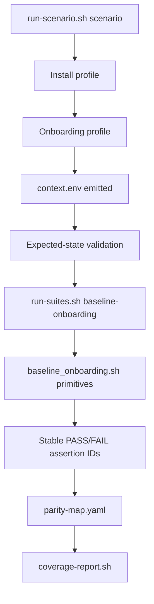

# Specification: Baseline Onboarding E2E Scenario Migration

## Overview & Objectives

Issue #3809 migrates the `baseline-onboarding` E2E coverage area into NemoClaw's layered scenario framework. The migration must absorb the highest-value assertions from these legacy scripts without porting them line-for-line:

- `test/e2e/test-full-e2e.sh`
- `test/e2e/test-cloud-onboard-e2e.sh`
- `test/e2e/test-cloud-inference-e2e.sh`
- `test/e2e/test-onboard-inference-smoke.sh`

The objective is to make install/onboard baseline coverage visible and executable through the scenario model introduced by parent epic #3588. Suites must consume `$E2E_CONTEXT_DIR/context.env` and must not reinstall NemoClaw, rerun onboard, or rediscover setup state independently.

### Goals

1. Add a reusable baseline onboarding domain primitive library.
2. Add scenario-suite steps that use the primitive library and emit stable assertion IDs.
3. Map high-value legacy assertions to stable scenario-side assertion IDs.
4. Explicitly classify remaining legacy assertions as `deferred` or `retired` with metadata.
5. Preserve `run-scenario.sh <id> --plan-only` behavior.
6. Keep the migration scoped to E2E framework files unless a validation bug requires otherwise.

### Non-Goals

- Do not rewrite the legacy scripts line-for-line.
- Do not change product onboarding behavior in `src/lib/onboard.ts`.
- Do not introduce a parallel E2E runner.
- Do not require macOS hosted runners to execute Docker-dependent baseline checks.
- Do not make brittle free-text diagnostic assertions mandatory unless a stable signal exists.

## Current State Analysis

### Existing Scenario Framework

The E2E scenario system is already organized into these layers:

```text
base environment setup
  → onboarding profile / test plan
    → expected-state validation
      → post-onboard validation suites
      → parity / coverage reporting
```

Key files:

- `test/e2e/nemoclaw_scenarios/scenarios.yaml` — platform, install, runtime, onboarding, setup scenarios.
- `test/e2e/nemoclaw_scenarios/expected-states.yaml` — expected state contracts.
- `test/e2e/validation_suites/suites.yaml` — suite definitions and ordered steps.
- `test/e2e/runtime/run-scenario.sh` — scenario resolver/executor.
- `test/e2e/runtime/run-suites.sh` — suite executor.
- `test/e2e/runtime/lib/context.sh` — normalized `context.env` helper.
- `test/e2e/docs/parity-map.yaml` — legacy assertion migration map.
- `test/e2e/runtime/coverage-report.sh` — scenario/parity coverage report.

### Existing Suite Coverage

Current suites include smoke, inference, credentials, onboarding-state, platform, Hermes, Ollama, and compatibility aliases. These cover important post-onboard behavior, but there is no dedicated `baseline-onboarding` suite for the core install/onboard assertions that legacy scripts still own.

Existing onboarding-state scripts already demonstrate the desired suite pattern:

1. Source `runtime/lib/context.sh`.
2. Source a domain helper (`runtime/lib/onboard-state.sh`).
3. Source `$E2E_CONTEXT_DIR/context.env`.
4. Assert against scenario-emitted state.
5. Emit `PASS: <stable-id>`.

### Gap

The framework lacks:

- `test/e2e/validation_suites/lib/baseline_onboarding.sh`.
- A `baseline-onboarding` suite family in `suites.yaml`.
- Suite steps for installed CLI/OpenShell, sandbox registration/status, logs, inference route, and stable smoke diagnostics.
- Complete parity-map entries for the relevant legacy assertions with `layer`, `gap_domain`, `owner`, and runner/secret metadata.

## Architecture Design

### Design Principles

1. **Context-first:** Helpers read normalized setup state from `$E2E_CONTEXT_DIR/context.env`.
2. **No setup side effects in suites:** Suites validate an already-created scenario; they do not install, onboard, destroy, rebuild, or discover global state beyond the context-provided IDs.
3. **Stable IDs:** Every migrated assertion emits `PASS: <layer>.<domain>.<behavior>` or `FAIL: <layer>.<domain>.<behavior>`.
4. **Domain primitive first:** Suite scripts remain thin wrappers over reusable helpers.
5. **Scenario-aware requirements:** Suite attachment must respect platform/runtime constraints, especially macOS optional Docker and Brev launchable requirements.
6. **Parity visibility:** Every legacy assertion from the scoped scripts is mapped, deferred, or retired.

### Target Flow



### New Domain Primitive Library

Create:

```text
test/e2e/validation_suites/lib/baseline_onboarding.sh
```

Responsibilities:

- Load/validate required context keys.
- Provide helper functions for baseline assertions.
- Encapsulate common command execution, timeout, and output capture patterns.
- Redact sensitive context in failure output.
- Emit stable assertion IDs through a single helper function.

Primitive functions:

- `baseline_onboarding_load_context`
- `baseline_onboarding_pass <id> <message>`
- `baseline_onboarding_fail <id> <message>`
- `baseline_assert_nemoclaw_on_path`
- `baseline_assert_openshell_on_path`
- `baseline_assert_nemoclaw_help_exits_zero`
- `baseline_assert_sandbox_list_contains_context_sandbox`
- `baseline_assert_sandbox_status_exits_zero`
- `baseline_assert_logs_produce_output`
- `baseline_assert_inference_route_provider <provider>`

The helper library should be shellcheck-friendly and should not mutate global scenario state. Policy preset checks stay in the existing onboarding-state validation unless legacy parity review shows a non-duplicative baseline assertion.

### Stable Assertion ID Namespace

Use this namespace pattern:

```text
validation.baseline_onboarding.<behavior>
```

Initial stable IDs:

- `validation.baseline_onboarding.nemoclaw_on_path`
- `validation.baseline_onboarding.openshell_on_path`
- `validation.baseline_onboarding.nemoclaw_help_exits_zero`
- `validation.baseline_onboarding.sandbox_listed`
- `validation.baseline_onboarding.sandbox_status`
- `validation.baseline_onboarding.logs_available`
- `validation.baseline_onboarding.inference_route_provider`
- `validation.baseline_onboarding.sandbox_inference_local_chat`

If the existing convention prefers hyphenated IDs, keep the semantic namespace but match repository style consistently.

### Suite Scripts

Create a new suite directory:

```text
test/e2e/validation_suites/baseline-onboarding/
```

Scripts:

```text
00-cli-and-openshell.sh
01-sandbox-state.sh
02-route-and-smoke.sh
```

Each script should:

1. `set -euo pipefail`.
2. Source `../lib/baseline_onboarding.sh`.
3. Load context.
4. Call one or more primitive assertions.
5. Avoid install/onboard/destructive commands.

### Suite Definition

Add to `test/e2e/validation_suites/suites.yaml`:

```yaml
baseline-onboarding:
  requires_state:
    cli.installed: true
  steps:
    - id: cli-and-openshell
      script: baseline-onboarding/00-cli-and-openshell.sh
    - id: sandbox-state
      script: baseline-onboarding/01-sandbox-state.sh
    - id: route-and-smoke
      script: baseline-onboarding/02-route-and-smoke.sh
```

Use existing expected-state vocabulary for `requires_state`. If `cli.installed` alone is insufficient for sandbox checks, split the suite into `baseline-install` and `baseline-onboarding`; do not add per-step conditionals unless an existing suite pattern already uses them.

### Scenario Attachment

Attach `baseline-onboarding` to scenarios where assertions are valid:

- `ubuntu-repo-cloud-openclaw`
- `ubuntu-repo-cloud-hermes`
- `ubuntu-repo-cloud-openclaw-custom-policies`
- `brev-launchable-cloud-openclaw` for launchable-compatible assertions only

Avoid attaching Docker/sandbox-dependent baseline steps to:

- `macos-repo-cloud-openclaw` when Docker is optional/unavailable.
- Negative preflight scenarios with no sandbox.

If one baseline suite cannot safely serve all target scenarios, split into:

- `baseline-install`
- `baseline-onboarding`
- `baseline-inference-route`

Prefer the smallest suite split that avoids conditional complexity.

### Parity Map Updates

Update `test/e2e/docs/parity-map.yaml` entries for:

- `test-full-e2e.sh`
- `test-cloud-onboard-e2e.sh`
- `test-cloud-inference-e2e.sh`
- `test-onboard-inference-smoke.sh`

For mapped assertions, include:

```yaml
- legacy: "nemoclaw --help exits 0"
  id: validation.baseline_onboarding.nemoclaw_help_exits_zero
  status: mapped
  layer: validation
  gap_domain: baseline-onboarding
  owner: e2e-maintainers
```

For deferred assertions, include:

```yaml
- legacy: "..."
  status: deferred
  reason: "requires live NVIDIA endpoint and stable diagnostic contract"
  layer: validation
  gap_domain: baseline-onboarding
  owner: e2e-maintainers
  runner_requirement: "Docker + OpenShell + NVIDIA API secret"
```

For retired assertions, include:

```yaml
- legacy: "..."
  status: retired
  reason: "covered by expected-state validation or obsolete duplicate"
  layer: validation
  gap_domain: baseline-onboarding
  reviewer: e2e-maintainers
  approved_at: "2026-05-20"
```

## Configuration & Deployment Changes

### New Files

- `test/e2e/validation_suites/lib/baseline_onboarding.sh`
- `test/e2e/validation_suites/baseline-onboarding/00-cli-and-openshell.sh`
- `test/e2e/validation_suites/baseline-onboarding/01-sandbox-state.sh`
- `test/e2e/validation_suites/baseline-onboarding/02-route-and-smoke.sh`

### Modified Files

- `test/e2e/validation_suites/suites.yaml`
- `test/e2e/nemoclaw_scenarios/scenarios.yaml`
- `test/e2e/docs/parity-map.yaml`
- Scenario framework tests under `test/e2e/scenario-framework-tests/` as needed.
- Documentation under `test/e2e/docs/README.md` only if new suite conventions need explanation.

### Environment Variables

No new required environment variables should be introduced.

Existing relevant variables:

- `E2E_CONTEXT_DIR`
- `E2E_SANDBOX_NAME`
- `E2E_AGENT`
- `E2E_PROVIDER`
- `E2E_GATEWAY_URL`
- `E2E_INFERENCE_ROUTE`
- `E2E_ONBOARDING_MODEL`
- `E2E_ONBOARDING_POLICY_PRESETS`

### Dependencies

No new npm, Python, or system dependencies should be required.

## Implementation Phases

## Phase 1: Legacy Assertion Inventory and Classification

### Objective

Classify the scoped legacy assertions into mapped, deferred, or retired groups and define the stable assertion IDs for mapped baseline behavior.

### Implementation Tasks

1. Extract PASS/FAIL strings from the four legacy scripts.
2. Group assertions by layer:
   - install
   - onboarding
   - expected-state
   - validation suite
   - diagnostics
   - cleanup/destructive lifecycle
3. Select highest-value assertions to migrate first.
4. Define stable assertion IDs under `validation.baseline_onboarding.*`.
5. Identify assertions that should remain deferred due to live endpoint, secret, or diagnostic stability requirements.
6. Identify assertions that should be retired as duplicates of expected-state validation or obsolete cleanup checks.

### Acceptance Criteria

- Every scoped legacy script has an updated `parity-map.yaml` entry plan.
- Every selected mapped assertion has a stable ID.
- Every non-mapped assertion has a documented deferred or retired reason.
- The classification distinguishes live E2E checks from schema-only metadata checks.

## Phase 2: Baseline Onboarding Primitive Library

### Objective

Create the reusable helper layer that suite steps will call for baseline install/onboard assertions.

### Implementation Tasks

1. Add `test/e2e/validation_suites/lib/baseline_onboarding.sh`.
2. Implement context loading and required-key validation.
3. Implement stable PASS/FAIL emission helpers.
4. Implement CLI/OpenShell availability assertions.
5. Implement sandbox list/status/log assertions.
6. Implement route/provider/policy assertions where context provides enough information.
7. Add helper-level tests using temporary `context.env` and mocked command binaries.

### Acceptance Criteria

- Helper library sources cleanly under `set -euo pipefail`.
- Helper functions do not install, onboard, destroy, or mutate scenario setup.
- Helper failures include actionable command output snippets without leaking secrets.
- Helper tests cover success and failure paths for the core assertions.
- Shellcheck-compatible style is preserved.

## Phase 3: Suite Integration

### Objective

Expose baseline helper assertions through scenario validation suites.

### Implementation Tasks

1. Add `test/e2e/validation_suites/baseline-onboarding/` step scripts.
2. Wire `baseline-onboarding` into `test/e2e/validation_suites/suites.yaml`.
3. Attach the suite to supported scenarios in `test/e2e/nemoclaw_scenarios/scenarios.yaml`.
4. Split into smaller suites if platform/runtime constraints require it.
5. Ensure each step emits stable assertion IDs through the primitive library.
6. Preserve `run-scenario.sh <id> --plan-only` output and behavior.

### Acceptance Criteria

- `run-scenario.sh ubuntu-repo-cloud-openclaw --plan-only` succeeds.
- `run-scenario.sh brev-launchable-cloud-openclaw --plan-only` succeeds.
- Suite schema/resolver tests pass.
- Suite scripts consume only `context.env` and scenario-provided state.
- Docker-dependent steps are not attached to scenarios that cannot satisfy them.

## Phase 4: Parity Map and Coverage Report Visibility

### Objective

Make baseline onboarding visible as covered, deferred, or retired in parity and coverage reporting.

### Implementation Tasks

1. Update `test/e2e/docs/parity-map.yaml` for the scoped legacy scripts.
2. Add `layer`, `gap_domain`, `owner`, and runner/secret metadata where applicable.
3. Mark high-value migrated assertions as `mapped` to stable IDs.
4. Mark remaining assertions as `deferred` or `retired` with evidence.
5. Run parity-map validation.
6. Run coverage report generation and verify baseline domain visibility.

### Acceptance Criteria

- Parity map validation passes for the updated entries.
- No scoped assertion remains silently uncategorized.
- Coverage report shows baseline onboarding as mapped/deferred/retired.
- Deferred entries identify owner and runner/secret requirements.
- Retired entries include reviewer/date evidence.

## Phase 5: Integration Verification

### Objective

Validate the migrated suite against framework behavior and, where possible, prepared E2E context.

### Implementation Tasks

1. Run relevant scenario framework Vitest files.
2. Run plan-only resolution for affected scenarios.
3. Run `run-suites.sh baseline-onboarding` against a mocked/prepared context.
4. If an appropriate live sandbox exists, run the suite in validate-only mode.
5. Capture any limitations in the PR description/test plan.

### Acceptance Criteria

- Scenario framework tests pass.
- Plan-only scenario resolution remains stable.
- Baseline suite can execute with a valid context.
- Failures are reported as stable assertion IDs.
- No product-code behavior changes are required.

## Phase 6: Clean the House

### Objective

Remove migration leftovers and update contributor-facing documentation.

### Implementation Tasks

1. Remove any temporary scripts or generated debug files.
2. Resolve implementation TODOs or convert them to issue-linked TODOs.
3. Update `test/e2e/docs/README.md` if the new baseline suite changes documented conventions.
4. Update `AGENTS.md` only if repository workflow guidance changes.
5. Re-run formatting/lint checks for touched files.
6. Confirm `git status` contains only intentional changes.

### Acceptance Criteria

- No temporary files remain.
- Documentation reflects the new suite if needed.
- TODOs are either resolved or linked to issues.
- Final diff is scoped to the E2E migration.
- Validation commands and known live-run limitations are documented.

## Risks & Mitigations

| Risk | Impact | Mitigation |
|---|---|---|
| Legacy assertions rely on brittle free-text logs | Flaky scenario suite | Defer diagnostics until structured/stable signals exist |
| Suite accidentally re-discovers global state | Violates #3588 architecture | Require context loading in helper tests and avoid install/onboard commands |
| One suite cannot serve all scenarios | Platform false failures | Split into smaller suites by capability |
| Live NVIDIA endpoint or secret requirements block local validation | Incomplete local proof | Mock helper tests locally; document live runner/secret requirements in parity map |
| Duplicate assertion IDs in parity map | Validation failure | Mark reusable IDs explicitly only when semantically identical |

## Test Strategy Summary

- Unit-style helper tests with temp `context.env` and mocked commands.
- Suite schema/resolver validation.
- Parity-map validation.
- Coverage-report validation.
- Plan-only scenario checks.
- Optional live validate-only suite run when a prepared scenario context exists.

## Open Questions

1. Which diagnostic assertions from `test-onboard-inference-smoke.sh` are stable enough to map now versus defer?
2. Should Brev launchable run the full baseline suite or only a launchable-compatible subset?
